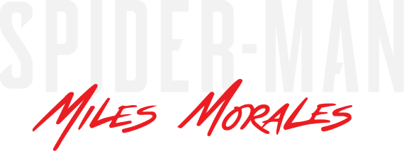
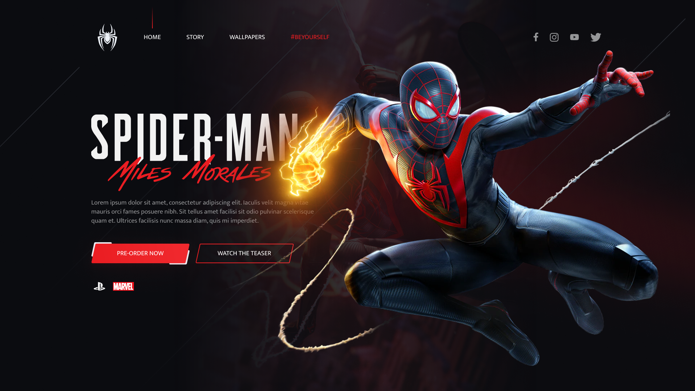

<h1 align="center">
    
</h1>

<h1 align="center">
    
</h1>

<h3 align="center">Você pode acessar o projeto <a href="https://spider-man-miles-morales.netlify.app/" target="_blank">clicando aqui</a></h3>

---

</br>

# Sobre o projeto

**Spider-man Miles Morales** é um projeto inspirado no jogo da Marvel disponível para consoles.
</br>
</br>
"Em sua mais nova aventura no universo de Marvel's Spider-man, o adolecente Miles Morales está se ajustando a sua nova casa, enquanto segue os passos de seu mentor, Peter Parker, como o novo Homem-aranha.Mas quando uma luta feroz pelo poder ameaça destruir sua nova casa, o aspirante a herói percebe que com grandes poderes, também deve vir uma grande responsabilidade.Para salvar toda a Nova Iorque da Marvel, Miles deve assumir o manto do Homem-Aranha e torná-lo seu."

<br/>

# Tecnologias

- [Html](https://www.w3schools.com/html/)
- [Css](https://www.w3schools.com/css/)
- [JavaScript](https://developer.mozilla.org/en-US/docs/Web/JavaScript)
- [Sass](https://sass-lang.com/)
- [Jquery](https://jquery.com/)
- [Gsap](https://greensock.com/gsap/)

---

<br/>

## Como baixar o projeto:

```bash
# Clonar o repositório
$ git clone https://github.com/wellingtonrodriguesbr/spider-man-miles-morales-website.git
# Entrar no diretório
$ cd spider-man-miles-morales-website
```

---

<p align="center"> Desenvolvido por <a href="https://www.linkedin.com/in/wellingtonrodriguesbr/">Wellington Rodrigues</a> ✌🏼</p>
